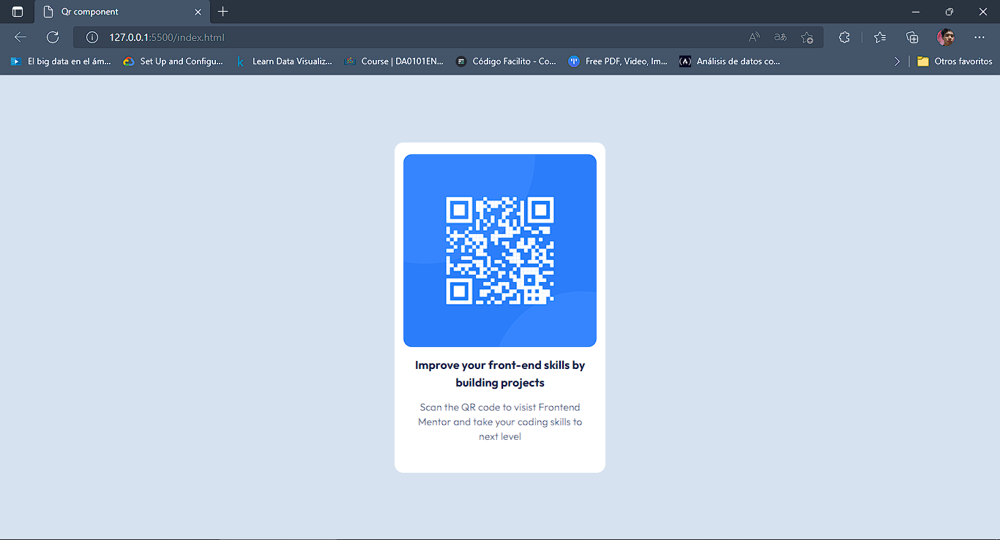
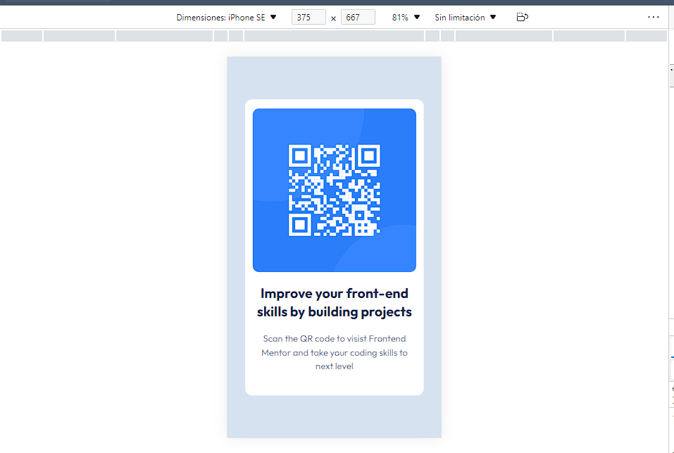

# Frontend Mentor - QR code component solution
## Overview

### Screenshot

### Links

- Solution URL: [Add solution URL here](https://github.com/SebastianSoto18/qrcomponent-)
- Live Site URL: [Add live site URL here](https://your-live-site-url.com)

## My process

### Built with

- Semantic HTML5 markup
- CSS custom properties
- Flexbox
- Tailwind CSS
- Mobile-first workflow

## Author

- Website - [Juan Sebastian Soto Martínez](https://www.linkedin.com/in/juan-sebastian-soto-martínez-b37703196/)
- Frontend Mentor - [@SebastianSoto18](https://www.frontendmentor.io/SebastianSoto18)

